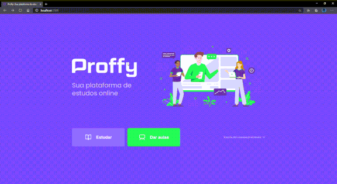

# projeto-proffy
Criando o projeto proffy, um projeto desenvolvido no Next Level Week que é um evento da Rocketseat. 
É uma plataforma de ensino. Cadastrando professores em suas datas e horas disponíveis. E no outro o aluno procura o professor disponível em data e hora que deseja, caso encontre, terá os dados mostrados. 

## Demo
### Desktop

### Mobile

### Tecnologia utilzada
HTML, CSS, JS, Node.js. Frameworks Node.js: Nodemon, Express.js, Nunjucks.  Banco de dados: SQLite.
API: Whatsapp API 

### Objetivo do projeto
Foi desenvolvido por motivo de aprendizagem.

### Desafios durante o projeto
Como não tinha conhecimento de Node.js e seus frameworks, SQLite e Whatsapp API. Tive bastante dificuldade para entender como funciona cada tecnologia, o fato de ter que executar o node para abrir servidor, o atalho que o nunjucks faz para transferir os dados do servidor para o front.

## Agradecimento
Quero agradecer à Rocketseat for disponibilizar este aprendizado. Em uma semana aprendi bastante sobre desenvolvimento utilizando node.js e frameworks, além de me sentir mais motivado a seguir na carreira de desenvolvimento web.
Obrigado Diego Fernandes (https://github.com/diego3g)
e Mayk Brito (https://github.com/maykbrito)
Vocês são demais!
